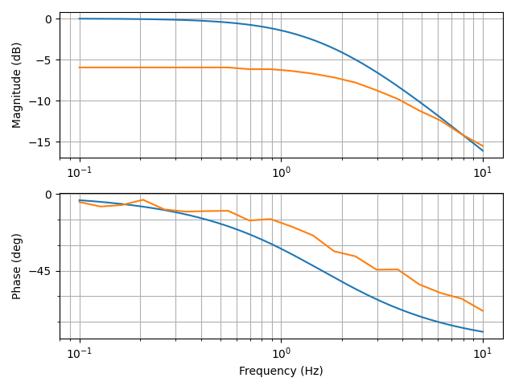
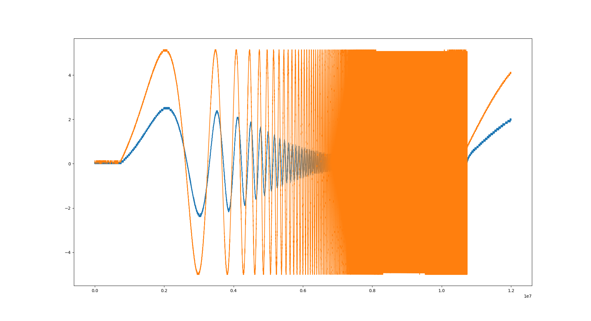

# Python Rigol control and measurement classes

## Supported Devices

### DS1054Z class

Ported to work for python 3.10+. See [test_ds.py](test_ds.py) for an example file.

[Credits](https://github.com/charkster/rigol_ds1054z)

[Programming Guide](https://beyondmeasure.rigoltech.com/acton/attachment/1579/f-0386/1/-/-/-/-/DS1000Z_Programming%20Guide_EN.pdf)

### DG800/DG900 class

Should support all DG8xx and DG9xx like I used DG992 to test the script, as they are based on the same Hardware. You can connect a cheap USB/LAN adapter to connect via your local network.

Added class to apply basic waveforms via the python script. Some advanced features like sync or custom waveforms are still not done yet.
See [test_dg.py](test_dg.py) for an example file.

[Programming Guide](https://beyondmeasure.rigoltech.com/acton/attachment/1579/f-08aa/0/-/-/-/-/DG900_ProgrammingGuide_EN.pdf)

## Installation

Install required pip packages

```shell
 python3 -m pip install -r requirements.txt
```

and then just run

```shell
 python3 test_ds.py
```

or

```shell
 python3 test_dg.py
```

## Combined and automated measurements

See ```test_combined.py``` for a automated bode plot measurement of electric circuits.

Below you can see the bode plots between a modeled low pass filter (blue) and the real measured LPF(R=1MOhm, C=100nF) (orange). The output voltage from the current generator has dropped due to the input impedance of the oscilloscope(1MOhm), resulting in half the measured voltage.



### Bode sweep measurement

The previous measurement has the disadvantage being really slow, a frequency sweep with a combined waveform capture can greatly inprove the bode plot speed and resolution. TODO: Gain and phase diff calculation.


